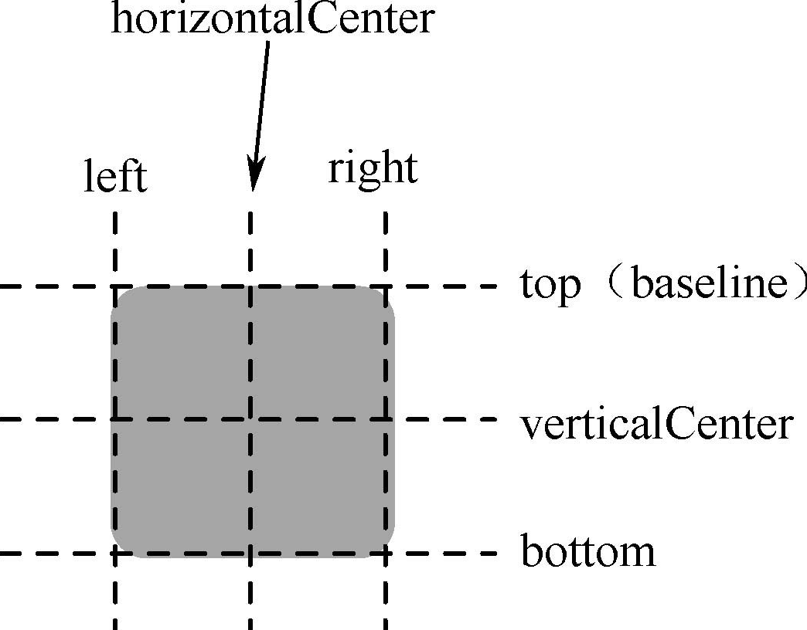
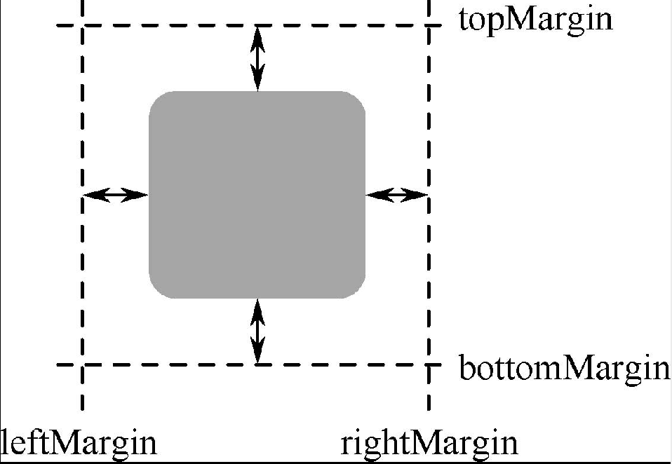

QML 编程中可以用 x、y 属性手动布局元素，但这些属性是与元素父对象左上角位置紧密相关的，不容易确定各子元素间的相对位置。为此，QML 提供了定位器和锚点来简化元素的布局。

## Positioner（定位器）

### 行列、网格定位

行列和网格定位分别使用Row、Column和Grid元素。

见源码 src/docs/CH19/CH1906。

### 流定位（Flow）

见源码 src/docs/CH19/CH1906。

### 重复器（Repeater）

重复器用于创建大量相似的元素成员，常与其他定位器结合起来使用。

见源码 src/docs/CH19/CH1907。

## Anchor（锚）

每一个元素都可以认为有一组无形的“锚线”：left、horizontalCenter、right、top、verticalCenter 和 bottom，如图 19.17 所示，Text 元素还有一个 baseline 锚线（对于没有文本的元素，它与 top 相同）。

这些锚线分别对应了元素中的 anchors.left、anchors.horizontalCenter 等属性，所有的可视元素都可以使用锚来布局。锚系统还允许为一个元素的锚指定边距（margin）和偏移（offset）。边距指定了元素锚到外边界的空间量，而偏移允许使用中心锚线来定位。一个元素可以通过 leftMargin、rightMargin、topMargin 和 bottomMargin 来独立地指定锚边距，如图 19.18 所示，也可以使用 anchor.margins 来为所有的 4 个锚指定相同的边距。

锚偏移使用 horizontalCenterOffset、verticalCenterOffset 和 baselineOffset 来指定。编程中还经常用到 anchors.fill 来将一个元素充满另一个元素，这等价于使用了 4 个直接的锚。但要注意，只能在父子或兄弟元素之间使用锚，而且基于锚的布局不能与绝对的位置定义（如直接设置 x 和 y 属性值）混合使用，否则会出现不确定的结果。

见源码 src/docs/CH19/CH1908。
