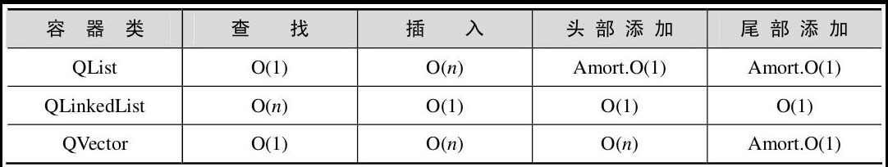
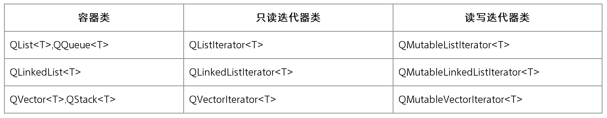
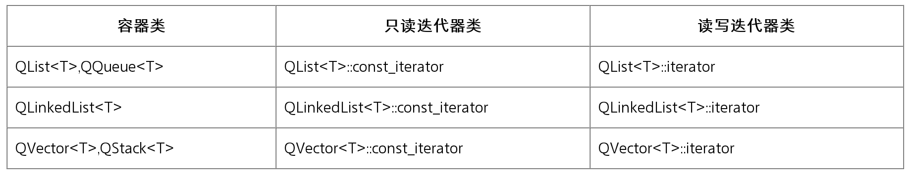
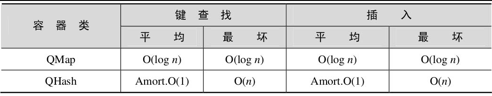
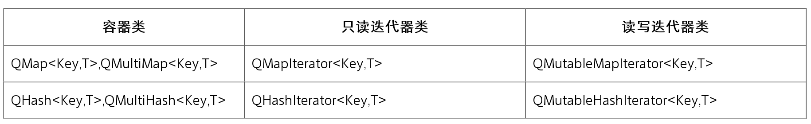
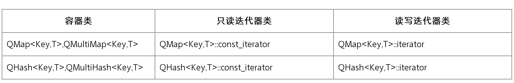

Qt 提供了一组通用的基于模板的容器类。对比 C++ 的标准模板库中的容器类，Qt 的这些容器更轻量、更安全并且更容易使用。此外，Qt 的容器类在速度、内存消耗和内联（inline）代码等方面进行了优化（较少的内联代码将会减少可执行程序的大小）。

存储在 Qt 容器中的数据必须是可赋值的数据类型，也就是说，这种数据类型必须提供一个默认的构造函数（不需要参数的构造函数）、一个复制构造函数和一个赋值操作运算符。

这样的数据类型包含了通常使用的大多数数据类型，包括基本数据类型（如 int 和 double 等）和 Qt 的一些数据类型（如 QString、QDate 和 QTime 等）。不过，Qt 的 QObject 及其他的子类（如 QWidget 和 Qdialog 等）是不能够存储在容器中的，例如：

```c++
QList<QToolBar> list;
```

上述代码是无法通过编译的，因为这些类（QObject及其他的子类）没有复制构造函数和赋值操作运算符。

一个可代替的方案是存储QObject及其子类的指针，例如：

```c++
QList<QToolBar*> list;
```

Qt的容器类是可以嵌套的，例如：

```c++
QHash<QString, QList<double> >
```

其中，QHash的键类型是QString，它的值类型是QList<double>。注意，在最后两个“>”符号之间要保留一个空格，否则，C++编译器会将两个“>”符号解释为一个“>>”符号，导致无法通过编译器编译。

Qt的容器类为遍历其中的内容提供了以下两种方法。

（1）Java风格的迭代器（Java-style iterators）。
（2）STL风格的迭代器（STL-style iterators），能够同Qt和STL的通用算法一起使用，并且在效率上也略胜一筹。

下面重点介绍经常使用的Qt容器类。

- [QList类、QLinkedList类和QVector类](#qlist类qlinkedlist类和qvector类)
  - [QList类](#qlist类)
  - [QLinkedList类](#qlinkedlist类)
  - [QVector类](#qvector类)
  - [Java风格迭代器遍历容器](#java风格迭代器遍历容器)
  - [STL风格迭代器遍历容器](#stl风格迭代器遍历容器)
- [QMap类和QHash类](#qmap类和qhash类)
  - [QMap类](#qmap类)
  - [QHash类](#qhash类)
  - [Java风格迭代器遍历容器](#java风格迭代器遍历容器-1)
  - [STL风格迭代器遍历容器](#stl风格迭代器遍历容器-1)

## QList类、QLinkedList类和QVector类

经常使用的Qt容器类有QList、QLinkedList和QVector等。在开发一个较高性能需求的应用程序时，程序员会比较关注这些容器类的运行效率。表2.1列出了QList、QLinkedList和QVector容器的时间复杂度比较。



其中，“Amort.O(1)”表示，如果仅完成一次操作，可能会有O(n)行为；但是如果完成多次操作（如n次），平均结果将会是O(1)。

### QList类

`QList<T>`是迄今为止最常用的容器类，它存储给定数据类型T的一列数值。继承自QList类的子类有QItemSelection、QQueue、QSignalSpy及QStringList和QTestEventList。

QList不仅提供了可以在列表进行追加的`QList::append()`和`Qlist::prepend()`函数，还提供了在列表中间完成插入操作的函数`QList::insert()`。相对于任何其他的Qt容器类，为了使可执行代码尽可能少，QList被高度优化。

`QList<T>`维护了一个指针数组，该数组存储的指针指向`QList<T>`存储的列表项的内容。因此，`QList<T>`提供了基于下标的快速访问。
对于不同的数据类型，`QList<T>`采取不同的存储策略，存储策略有以下几种。

（1）如果T是一个指针类型或指针大小的基本类型（即该基本类型占有的字节数和指针类型占有的字节数相同），QList<T>会将数值直接存储在它的数组中。

（2）如果`QList<T>`存储对象的指针，则该指针指向实际存储的对象。

```c++
#include <QDebug>
int main(int argc,char *argv[])
{
    QList<QString> list;       //(a)
    {
        QString str("This is a test string");
        list<<str;         //(b)
    }            //(c)
    qDebug()<<list[0]<< "How are you! ";
    return 0;
}
```

其中，

(a)` QList<QString> list`：声明了一个`QList<QString>`栈对象。
(b)` list<<str`：通过操作运算符“<<”将一个QString字符串存储在该列表中。
(c) 程序中使用花括弧“{”和“}”括起来的作用域表明，此时`QList<T>`**保存了对象的一个复制**。

### QLinkedList类

`QLinkedList<T>`是一个链式列表，它以非连续的内存块保存数据。
`QLinkedList<T>`不能使用下标，只能使用迭代器访问它的数据项。与QList相比，当对一个很大的列表进行插入操作时，QLinkedList具有更高的效率。

### QVector类

`QVector<T>`在相邻的内存中存储给定数据类型T的一组数值。在一个QVector的前部或者中间位置进行插入操作的速度是很慢的，这是因为这样的操作将导致内存中的大量数据被移动，这是由QVector存储数据的方式决定的。

`QVector<T>`既可以使用下标访问数据项，也可以使用迭代器访问数据项。继承自QVector类的子类有QPolygon、QPolygonF和QStack。

### Java风格迭代器遍历容器

Java风格的迭代器是Qt 4加入的一个功能。同STL风格的迭代器相比，它使用起来更简单方便，不过这也是以轻微的性能损耗为代价的。对于每一个容器类，Qt都提供了两种类型的Java风格迭代器数据类型，即只读访问和读写访问，其分类见表2.2。



Java风格迭代器的迭代点（Java-style iterators point）位于列表项的中间，而不是直接指向某个列表项。因此，它的迭代点或者在第一个列表项的前面，或者在两个列表项之间，或者在最后一个列表项之后。

下面以QList为例，介绍Java风格的两种迭代器的用法。QLinkedList和QVector具有和QList相同的遍历接口，在此不再详细讲解。

（1）QList只读遍历方法。

【例】（简单）　通过控制台程序实现QList只读遍历方法。实例文件见光盘CH201。

对于Qt的一些类，如QString、QList等，不需要QCoreApplication（对于GUI用户界面程序则使用QApplication）的支持也能够工作，因此本例没有创建QCoreApplication对象。但是，在使用Qt编写应用程序时，如果是控制台应用程序，则建议初始化一个QCoreApplication对象；如果是GUI图形用户界面程序，则建议初始化QApplication对象。

其具体代码如下：

```c++
#include <QDebug>      //(a)
int main(int argc,char *argv[])
{
    QList<int> list;     //创建一个QList<int>栈对象list
    list<<1<<2<<3<<4<<5;    //用操作运算符“<<”输入五个整数
    QListIterator<int> i(list);   //(b)
    for(;i.hasNext();)     //(c)
        qDebug()<<i.next();
    return 0;
}
```

其中，

(a) 头文件`<QDebug>`中已经包含了QList的头文件。
(b) `QListIterator<int> i(list)`：以该list为参数初始化一个QListIterator对象i。此时，迭代点处在第一个列表项“1”的前面（注意，并不是指向该列表项）。
(c) `for(;i.hasNext();)`：调用`QListIterator<T>::hasNext()`函数检查当前迭代点之后是否有列表项。如果有，则调用`QListIterator<T>::next()`函数进行遍历。`next()`函数将会跳过下一个列表项（即迭代点将位于第一个列表项和第二个列表项之间），并返回它跳过的列表项的内容。

最后程序的运行结果为：

```c++
1 2 3 4 5
```

上述例子是QListIterator<T>对列表进行向后遍历的函数，而对列表进行向前遍历的函数有如下几种。QListIterator<T>::toBack()：将迭代点移动到最后一个列表项的后面。QListIterator<T>::hasPrevious()：检查当前迭代点之前是否具有列表项。QListIterator<T>::previous()：返回前一个列表项的内容并将迭代点移动到前一个列表项之前。

除此之外，QListIterator<T>提供的其他函数还有如下几种。toFront()：移动迭代点到列表的前端（第一个列表项的前面）。peekNext()：返回下一个列表项，但不移动迭代点。peekPrevious()：返回前一个列表项，但不移动迭代点。

findNext()：从当前迭代点开始向后查找指定的列表项，如果找到，则返回true，此时迭代点位于匹配列表项的后面；如果没有找到，则返回false，此时迭代点位于列表的后端（最后一个列表项的后面）。findPrevious()：与findNext()类似，不同的是它的方向是向前的，查找操作完成后的迭代点在匹配项的前面或整个列表的前端。

（2）QListIterator<T>是只读迭代器，它不能完成列表项的插入和删除操作。读写迭代器QMutableListIterator<T>除了提供基本的遍历操作（与QListIterator的操作相同）外，还提供了insert()插入操作函数、remove()删除操作函数和修改数据函数等。

【例】（简单）　通过控制台程序实现QList读写遍历方法。实例文件见光盘CH202。

```c++
#include <QDebug>
int main(int argc,char *argv[])
{
    QList<int> list;      //创建一个空的列表list
    QMutableListIterator<int> i(list);  //创建上述列表的读写迭代器
    for(int j=0;j<10;++j)
        i.insert(j);      //(a)
    for(i.toFront();i.hasNext();)   //(b)
        qDebug()<<i.next();
    for(i.toBack();i.hasPrevious();)  //(c)
    {
        if(i.previous()%2==0)
              i.remove();
        else
            i.setValue(i.peekNext()*10);  //(d)
    }
    for(i.toFront();i.hasNext();)   //重新遍历并输出列表
            qDebug()<<i.next();
    return 0;
}
```

其中，
(a) i.insert(j)：通过`QMutableListIterator<T>::insert()`插入操作，为该列表插入十个整数值。
(b) `for(i.toFront();i.hasNext();)、qDebug()<<i.next()`：将迭代器的迭代点移动到列表的前端，完成对列表的遍历和输出。
(c) `for(i.toBack();i.hasPrevious();){…}`：移动迭代器的迭代点到列表的后端，对列表进行遍历。如果前一个列表项的值为偶数，则将该列表项删除；否则，将该列表项的值修改为原来的十倍。
(d)` i.setValue(i.peekNext()*10)`：函数`QMutableListIterator<T>::setValue()`修改遍历函数next()、previous()、findNext()和findPrevious()跳过的列表项的值，但不会移动迭代点的位置。对于findNext()和findPrevious()有些特殊：当findNext()（或findPrevious()）查找到列表项的时候，setValue()将会修改匹配的列表项；如果没有找到，则对setValue()的调用将不会进行任何修改。

最后编译，运行此程序，程序运行结果如下：

```c++
0 1 2 3 4 5 6 7 8 9
10 30 50 70 90
```

### STL风格迭代器遍历容器

对于每一个容器类，Qt都提供了两种类型的STL风格迭代器数据类型：一种提供只读访问；另一种提供读写访问。由于只读类型的迭代器的运行速度要比读写迭代器的运行速度快，所以应尽可能地使用只读类型的迭代器。STL风格迭代器的两种分类见表2.3。



STL风格迭代器的API是建立在指针操作基础上的。例如，“++”操作运算符移动迭代器到下一个项（item），而“*”操作运算符返回迭代器指向的项。

不同于Java风格的迭代器，STL风格迭代器的迭代点直接指向列表项。

【例】（简单）　使用STL风格迭代器。实例文件见光盘CH203。

```c++
#include <QDebug>
int main(int argc,char *argv[])
{
    QList<int> list;      //初始化一个空的QList<int>列表
    for(int j=0;j<10;j++)
         list.insert(list.end(),j);   //(a)
    QList<int>::iterator i;
                           //初始化一个QList<int>::iterator读写迭代器
    for(i=list.begin();i!=list.end();++i) //(b)
    {
         qDebug()<<(*i);
         *i=(*i)*10;
    }
    //初始化一个QList<int>:: const_iterator读写迭代器
    QList<int>::const_iterator ci;
    //在控制台输出列表的所有值
    for(ci=list.constBegin();ci!=list.constEnd();++ci)
         qDebug()<<*ci;
    return 0;
}
```

其中，

(a) list.insert(list.end(),j)：使用QList<T>::insert()函数插入十个整数值。此函数有两个参数：第一个参数是QList<T>::iterator类型，表示在该列表项之前插入一个新的列表项（使用QList<T>::end()函数返回的迭代器，表示在列表的最后插入一个列表项）；第二个参数指定了需要插入的值。

(b) for(i=list.begin();i!=list.end();++i){…}：在控制台输出列表的同时将列表的所有值增大10倍。这里用到两个函数：QList<T>::begin()函数返回指向第一个列表项的迭代器；QList<T>::end()函数返回一个容器最后列表项之后的虚拟列表项，为标记无效位置的迭代器，用于判断是否到达容器的底部。

最后编译，运行此应用程序，输出结果如下：

```c++
0  1   2   3   4   5   6   7   8   9
0  10  20  30  40  50  60  70  80  90
```

QLinkedList和QVector具有和QList相同的遍历接口。

## QMap类和QHash类

QMap类和QHash类具有非常类似的功能，它们的差别仅在于：

QHash具有比QMap更快的查找速度。
QHash以任意的顺序存储数据项，而QMap总是按照键Key顺序存储数据。
QHash的键类型Key必须提供operator==()和一个全局的qHash(Key)函数，而QMap的键类型Key必须提供operator<()函数。

二者的时间复杂度比较见表2.4。



### QMap类

QMap<Key,T>提供了一个从类型为Key的键到类型为T的值的映射。

通常，QMap存储的数据形式是一个键对应一个值，并且按照键Key的次序存储数据。为了能够支持一键多值的情况，QMap提供了QMap<Key,T>::insertMulti()和QMap<Key,T>::values()函数。存储一键多值的数据时，也可以使用QMultiMap<Key,T>容器，它继承自QMap。

### QHash类

QHash<Key,T>具有与QMap几乎完全相同的API。QHash维护着一张哈希表（Hash Table），哈希表的大小与QHash的数据项的数目相适应。

QHash以任意的顺序组织它的数据。当存储数据的顺序无关紧要时，建议使用QHash作为存放数据的容器。QHash也可以存储一键多值形式的数据，它的子类QMultiHash<Key,T>实现了一键多值的语义。

### Java风格迭代器遍历容器

对于每一个容器类，Qt都提供了两种类型的Java风格迭代器数据类型：一种提供只读访问；另一种提供读写访问。其分类见表2.5。



【例】（简单）　在QMap中的插入、遍历和修改。实例文件见光盘CH204。

```c++
#include <QDebug>
int main(int argc,char *argv[])
{
    QMap<QString,QString> map;     //创建一个QMap栈对象
    //向栈对象插入<城市,区号>对
    map.insert("beijing","111");
    map.insert("shanghai","021");
    map.insert("nanjing","025");
    QMapIterator<QString,QString> i(map);  //创建一个只读迭代器
    for(;i.hasNext();)       //(a)
        qDebug()<<"  "<<i.key()<<"  "<<i.next().value();
    QMutableMapIterator<QString,QString> mi(map);
    if(mi.findNext("111"))      //(b)
        mi.setValue("010");
    QMapIterator<QString,QString> modi(map);
    qDebug()<<"  ";
    for(;modi.hasNext();)      //再次遍历并输出修改后的结果
        qDebug()<<" "<<modi.key()<<"  "<<modi.next().value();
    return 0;
}
```

其中，

(a) `for(;i.hasNext();)、qDebug()<<" "<<i.key()<<" "<<i.next().value()`：完成对QMap的遍历输出。在输出QMap的键和值时，调用的函数是不同的。因为在输出键的时候，不需要使迭代点移动到下一个位置，所以调用了QMapIterator<T,T>::key()；而在输出值的时候调用了QMapIterator <T,T>::next()。
(b) if(mi.findNext("111"))、mi.setValue("010")：首先查找某个<键,值>对，然后修改值。Java风格的迭代器没有提供查找键的函数。因此，在本例中通过查找值的函数QMutableMapIterator<T,T>::findNext()来实现查找和修改。

最后编译、运行此程序，程序运行结果如下：

```
"beijing"     "111"
"nanjing"     "025"
"shanghai"    "021"
"beijing"     "010"
"nanjing"     "025"
"shanghai"    "021"
```

### STL风格迭代器遍历容器

对于每一个容器类，Qt都提供了两种类型的STL风格迭代器数据类型：一种提供只读访问；另一种提供读写访问。其分类见表2.6。



【例】（简单）　功能与使用Java风格迭代器的例子基本相同。不同的是，这里通过查找键来实现值的修改。实例文件见光盘CH205。

```c++
include <QDebug>
int main(int argc,char *argv[])
{
    QMap<QString,QString> map;
    map.insert("beijing","111");
    map.insert("shanghai","021");
    map.insert("jinan","0531");
        QMap<QString,QString>::const_iterator i;
    for(i=map.constBegin();i!=map.constEnd();++i)
        qDebug()<<"  "<<i.key()<<"  "<<i.value();
    QMap<QString,QString>::iterator mi;
    mi=map.find("beijing");
    if(mi!=map.end())
        mi.value()="010";    //(a)
    QMap<QString,QString>::const_iterator modi;
    qDebug()<<"  ";
    for(modi=map.constBegin();modi!=map.constEnd();++modi)
        qDebug()<<"  "<<modi.key()<<"  "<<modi.value();
    return 0;
}
```

其中，(a) mi.value()="010"：将新的值直接赋给QMap<QString,QString>::iterator::value()返回的结果，因为该函数返回的是<键,值>对其中值的引用。
