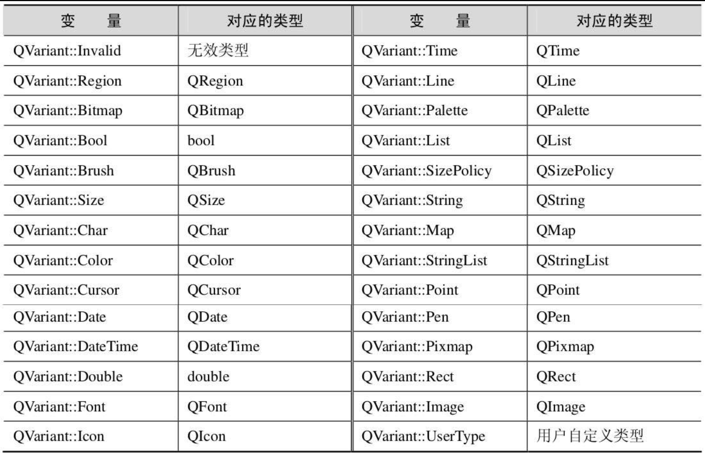

QVariant类类似于C++的联合（union）数据类型，它不仅能够保存很多Qt类型的值，包括QColor、QBrush、QFont、QPen、QRect、QString和QSize等，也能够存放Qt的容器类型的值。Qt的很多功能都是建立在QVariant基础上的，如Qt的对象属性及数据库功能等。

【例】（简单）　QVariant类的用法。实例文件见光盘CH206。

新建Qt Widgets Application，项目名称为“myVariant”，基类选择“QWidget”，类名保持“Widget”不变，取消选择“创建界面”复选框。建好项目后，在widget.cpp文件中编写代码，具体内容如下：

```c++
#include "widget.h"
#include <QDebug>
#include <QVariant>
#include <QColor>
Widget::Widget(QWidget *parent)
    : QWidget(parent)
{
    QVariant v(709);      //(a)
    qDebug()<<v.toInt();    //(b)
    QVariant w("How are you! ");  //(c)
    qDebug()<<w.toString();    //(d)
    QMap<QString,QVariant>map;    //(e)
    map["int"]=709;      //输入整数型
    map["double"]=709.709;     //输入浮点型
    map["string"]="How are you! ";   //输入字符串
    map["color"]=QColor(255,0,0);   //输入QColor类型的值
    //调用相应的转换函数并输出
    qDebug()<<map["int"]<< map["int"].toInt();
    qDebug()<<map["double"]<< map["double"].toDouble();
    qDebug()<<map["string"]<< map["string"].toString();
    qDebug()<<map["color"]<< map["color"].value<QColor>(); //(f)
    QStringList sl;      //创建一个字符串列表
    sl<<"A"<<"B"<<"C"<<"D";
    QVariant slv(sl);      //将该列表保存在一个QVariant变量中
    if(slv.type()==QVariant::StringList)//(g)
    {
        QStringList list=slv.toStringList();
        for(int i=0;i<list.size();++i)
            qDebug()<<list.at(i);   //输出列表内容
    }
}
Widget::~Widget()
{
}
```

其中，

(a) QVariant v(709)：声明一个QVariant变量v，并初始化为一个整数。此时，QVariant变量v包含了一个整数变量。
(b) `qDebug()<<v.toInt()`：调用`QVariant::toInt()`函数将QVariant变量包含的内容转换为整数并输出。
(c) `QVariant w("How are you! ")`：声明一个QVariant变量w，并初始化为一个字符串。
(d) `qDebug()<<w.toString()`：调用QVariant::toString()函数将QVariant变量包含的内容转换为字符串并输出。
(e) QMap<QString,QVariant>map：声明一个QMap变量map，使用字符串作为键，QVariant变量作为值。
(f) `qDebug()<<map["color"]<< map["color"].value<QColor>()`：在 QVariant 变量中保存了一个 QColor 对象，并使用模板 QVariant::value()还原为 QColor，然后输出。由于 QVariant 是 QtCore 模块的类，所以它没有为 QtGui 模块中的数据类型（如 QColor、QImage 及 QPixmap 等）提供转换函数，因此需要使用 QVariant::value()函数或者QVariantValue()模块函数。
(g) `if(slv.type()==QVariant::StringList)`：QVariant::type()函数返回存储在QVariant变量中的值的数据类型。`QVariant::StringList`是Qt定义的一个QVariant::type枚举类型的变量，其他常用的枚举类型变量见表2.7。



最后，运行上述程序的结果如下：

```
709
"How are you! "
QVariant(int,709) 709
QVariant(double,709.709) 709.709
QVariant(QString, "How are you! ") "How are you! "
QVariant(QColor, QColor(ARGB 1,1,0,0)) QColor(ARGB 1,1,0,0)
"A"
"B"
"C"
"D"
```
