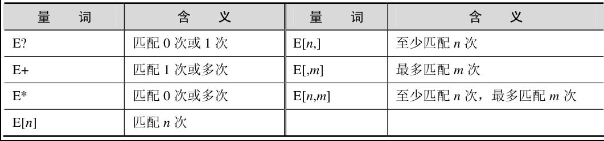
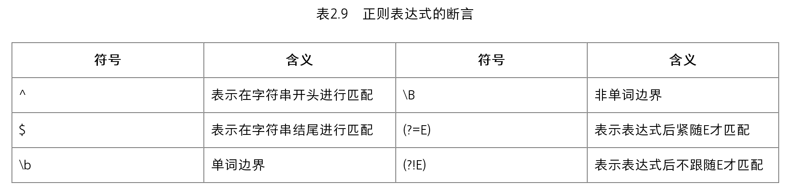

本节首先介绍Qt的<QtAlgorithms>和<QtGlobal>模块中提供的几种常用算法，然后介绍基本的正则表达式。

## Qt 5常用算法

【例】（简单）　几个常用算法。实例文件见光盘CH207。

```c++
#include <QDebug>
int main(int argc,char *argv[])
{
   double a=-19.3,b=9.7;
   double c=qAbs(a);            //(a)
   double max=qMax(b,c);         //(b)
   int bn=qRound(b);            //(c)
   int cn=qRound(c);
   qDebug()<<"a="<<a;
   qDebug()<<"b="<<b;
   qDebug()<<"c=qAbs(a)= "<<c;
   qDebug()<<"qMax(b,c)= "<<max;
   qDebug()<<"bn=qRound(b)= "<<bn;
   qDebug()<<"cn=qRound(c)= "<<cn;
   qSwap(bn,cn);       //(d)
   //调用qDebug()函数输出所有的计算结果
   qDebug()<<"qSwap(bn,cn):"<<"bn="<<bn<<" cn="<<cn;
   return 0;
}
```

其中，

(a) double c=qAbs(a)：函数qAbs()返回double型数值a的绝对值，并赋值给c（c=19.3）。
(b) double max=qMax(b,c)：函数qMax()返回两个数值中的最大值（max=c=19.3）。
(c) int bn=qRound(b)：函数qRound()返回与一个浮点数最接近的整数值，即四舍五入返回一个整数值（bn=10，cn=19）。
(d) qSwap(bn,cn)：函数qSwap()交换两数的值。

最后，编译运行上述程序，输出结果如下：

```c++
a= -19.3
b= 9.7
c=qAbs(a)= 19.3
qMax(b,c)= 19.3
bn=qRound(b)= 10
cn=qRound(c)= 19
qSwap(bn,cn):  bn= 19   cn= 10
```

## 基本的正则表达式

使用正则表达式可以方便地完成处理字符串的一些操作，如验证、查找、替换和分割等。Qt的QRegExp类是正则表达式的表示类，它基于Perl的正则表达式语言，完全支持Unicode。
正则表达式由表达式（expressions）、量词（quantifiers）和断言（assertions）组成。
（1）最简单的表达式是一个字符。要表示字符集的表达式可以使用如“[AEIOU]”表示匹配所有的大写元音字母；使用“[^AEIOU]”则表示匹配所有非元音字母，即辅音字母；连续的字符集可以使用表达式如“[a-z]”，表示匹配所有小写英文字母。
（2）量词说明表达式出现的次数，如“x[1,2]”表示“x”可以至少有一个，至多两个。
在计算机语言中，标识符通常要求以字母或下画线（也称下划线）开头，后面可以是字母、数字和下画线。满足条件的标识符表示为：

```c++
" [A-Za-z_]+[A-Za-z_0-9]* "
```

其中，表达式中的“+”表示“[A-Za-z_]”至少出现一次，可以出现多次；“*”表示“[A-Za-z_0-9]”可以出现零次或多次。



（3）“^”、“$”、“\b”都是正则表达式的断言，正则表达式的断言见表2.9。



例如，若要只有在using后面是namespace时才匹配using，则可以使用“using(?=E\s+namespace)”（此处“?=E”后的“\s”表示匹配一个空白字符，下同）。

如果使用“using(?!E\s+namespace)”，则表示只有在using后面不是namespace时才匹配using。

如果使用“using\s+namespace”，则匹配为using namespace。
