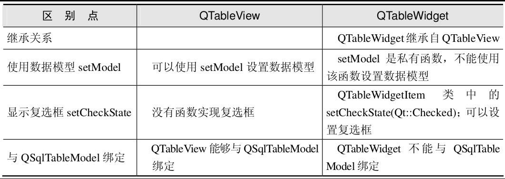

## 按钮组（Buttons）

Push Button：按钮。
Tool Button：工具按钮。
Radio Button：单选按钮。
Check Box：复选框。
Command Link Button：命令链接按钮。
Button Box：按钮盒。

## 输入部件组（Input Widgets）

Combo Box：组合框。
Font Combo Box：字体组合框。
Line Edit：行编辑。
Text Edit：文本编辑。
Plain Text Edit：纯文本编辑。
Spin Box：数字显示框（自旋盒）。
Double Spin Box：双自旋盒。
Time Edit：时间编辑。
Date Edit：日期编辑。
Date/Time Edit：日期/时间编辑。
Dial：拨号。
Horizontal Scroll Bar：横向滚动条。
Vertical Scroll Bar：垂直滚动条。
Horizontal Slider：横向滑块。
Vertical Slider：垂直滑块。
Key sequence Edit：按键序列编辑。

### QDateTime类

Date/Time Edit对应于QDateTime类，在Qt 5中可以使用它来获得系统时间。通过QDateTime::currentDateTime()来获取本地系统的时间和日期信号。可以通过date()和time()来返回datetime中的日期和时间部分，代码如下：

```c++
QLabel * datalabel =new QLabel();
QDateTime *datatime=new QDateTime(QDateTime::currentDateTime());
datalabel->setText(datatime->date().toString());
datalabel->show();
```

### QTimer类

定时器（QTimer）的使用非常简单，只需要以下几个步骤就可以完成定时器的应用。

（1）新建一个定时器。

```c++
QTimer *time_clock=new QTimer(parent);
```

（2）连接这个定时器的信号和槽，利用定时器的timeout()。

```c++
connect(time_clock,SIGNAL(timeout()),this,SLOT(slottimedone()));
```

即定时时间一到就会发送timeout()信号，从而触发slottimedone()槽去完成某件事情。

（3）开启定时器，并设定定时周期。

定时器定时有两种方式：start(int time)和setSingleShot(true)。其中，start(int time)表示每隔“time”秒就会重启定时器，可以重复触发定时，利用stop()将定时器关掉；而setSingleShot(true)则是仅启动定时器一次。工程中常用的是前者，例如：

```c++
time_clock->start(2000);
```

## 显示控件组（Display Widgets）

Label：标签。
Text Browser：文本浏览器。
Graphics View：图形视图。
Calendar：日历。
LCD Number：液晶数字。
Progress Bar：进度条。
Horizontal Line：水平线。
Vertical Line：垂直线。
Open GL Widget：开放式图形库工具。
QQuickWidget：嵌入QML工具。
QWebView：Web视图。

### Graphics View

Graphics View对应于QGraphicsView类，提供了Qt 5的图形视图框架。

### Text Browser

Text Browser对应于QTextBrowser类。QTextBrowser类继承自QTextEdit，而且仅是只读的，对里面的内容并不能进行更改，但是相对于QTextEdit来讲，它还具有链接文本的作用。QTextBrowser的属性有以下几点：

```c++
modified : const bool          //通过布尔值来说明其内容是否被修改
openExternalLinks : bool
openLinks : bool
readOnly : const bool
searchPaths : QStringList
source : QUrl
undoRedoEnabled : const b
```

通过以上的属性设置，可以设定QTextBrowser是否允许外部链接，是否为只读属性，外部链接的路径及链接的内容，是否可以进行撤销等操作。

QTextBrowser还提供了几种比较有用的槽（SLOTS），即：

```c++
virtual void backward ()
virtual void forward ()
virtual void home ()
```

可以通过链接这几个槽来达到人们常说的“翻页”效果。

## QQuickWidget

这是 Qt 5.3 发布的一个新组件，传统 QWidget 程序可以用它来嵌入 QML 代码，为 Qt 开发者将桌面应用迁移到 Qt Quick 提供了方便，但目前在 QML 中尚不能嵌入其他非 QML 窗口，因为 QML 的渲染机制和 QWidget 的是不一样的。

## 空间间隔组（Spacers）

Horizontal Spacer：水平间隔。
Vertical Spacer：垂直间隔。

## 布局管理组（Layouts）

Vertical Layout：垂直布局。
Horizontal Layout：横向（水平）布局。
Grid Layout：网格布局。
Form Layout：表单布局。

## 容器组（Containers）

Group Box：组框。
Scroll Area：滚动区域。
Tool Box：工具箱。
Tab Widget：标签小部件。
Stacked Widget：堆叠部件。
Frame：帧。
Widget：小部件。
MdiArea：MDI区域。
Dock Widget：停靠窗体部件。
QAxWidget：封装Flash的ActiveX控件。

### QWidget

下面介绍 Widget 对应 QWidget 类的用法。Widget 是使用 Qt 编写的图形用户界面（GUI）应用程序的基本生成块。每个 GUI 组件，如按钮、标签或文本编辑器，都是一个 Widget，并可以放置在现有的用户界面中或作为单独的窗口显示。每种类型的组件都是由 QWidget 的特殊子类提供的，而 QWidget 自身又是 QObject 的子类。

QWidget 是所有 Qt GUI界面类的基类，它接收鼠标、键盘及其他窗口事件，并在显示器上绘制自己。

通过传入 QWidget 构造函数的参数（或者调用 `QWidget::setWindowFlags()` 和 `QWidget::setParent()` 函数）可以指定一个窗口部件的窗口标识（window flags）和父窗口部件。

窗口部件的窗口标识（window flags）定义了窗口部件的窗口类型和窗口提示（hint）。窗口类型指定了窗口部件的窗口系统属性（window-system properties），一个窗口部件只有一个窗口类型。窗口提示定义了顶层窗口的外观，一个窗口可以有多个提示（提示能够进行按位或操作）。

没有父窗口部件的 Widget 对象是一个窗口，窗口通常具有一个窗口边框（frame）和一个标题栏。QMainWindow 和所有的 QDialog 对话框子类都是经常使用的窗口类型，而子窗口部件通常处在父窗口部件的内部，没有窗口边框和标题栏。

QWidget 窗口部件的构造函数为：

```c++
QWidget(QWidget *parent=0,Qt::WindowFlags f=0)
```

其中，参数 parent 指定了窗口部件的父窗口部件，如果 parent=0（默认值），则新建的窗口部件将是一个窗口；否则，新建的窗口部件是 parent 的子窗口部件（是否是一个窗口还需要第 2 个参数决定）。如果新窗口部件不是一个窗口，则它将会出现在父窗口部件的界面内部。参数 f 指定了新窗口部件的窗口标识，默认值是 0，即 `Qt::Widget`。

QWidget 定义的窗口类型为 Qt::WindowFlags 枚举类型，它们的可用性依赖于窗口管理器是否支持它们。

QWidget 不是一个抽象类，它可用作其他 Widget 的容器，并很容易作为子类来创建定制 Widget。它经常用于创建放置其他 Widget 的窗口。

至于 QObject，可使用父对象创建 Widget 以表明其所属关系，这样可以确保删除不再使用的对象。使用 Widget，这些父子关系就有了更多的意义，每个子类都显示在其父级所拥有的屏幕区域内。也就是说，当删除窗口时，其包含的所有 Widget 也都自动删除。

#### 创建窗口

如果 Widget 未使用父级进行创建，则在显示时视为窗口或顶层 Widget。由于顶层 Widget 没有父级对象类来确保在其不再使用时就删除，所以需要开发人员在应用程序中对其进行跟踪。

在本例中，使用 QWidget 创建和显示具有默认大小的窗口：

```c++
#include <QApplication>
#include <QPushButton>

int main(int argc, char *argv[]) {
        QApplication a(argc, argv);

        auto *window = new QWidget();
        window->resize(320, 240);
        window->show();
        auto *button = new QPushButton("Press me", window); //(a)
        button->move(100, 100);
        button->show();

        return QApplication::exec();
}
```

其中，

(a) `QPushButton *button = new QPushButton(tr("Press me"), window);`：通过将window作为父级传递给其构造器来向窗口添加子Widget:button。在这种情况下，向窗口添加按钮并将其放置在特定位置。该按钮现在为窗口的子项，并在删除窗口时同时删除。请注意，隐藏或关闭窗口不会自动删除该按钮。

####  使用布局

通常，子Widget是通过使用布局对象在窗口中进行排列的，而不是通过指定位置和大小进行排列的。在此，构造一个并排排列的标签和行编辑框Widget：

```c++
#include <QApplication>
#include <QHBoxLayout>
#include <QLabel>
#include <QLineEdit>
#include <QPushButton>

int main(int argc, char *argv[]) {
    QApplication a(argc, argv);

    auto *window = new QWidget();
    auto *label = new QLabel("Name:");
    auto *lineEdit = new QLineEdit();

    auto *layout = new QHBoxLayout();
    layout->addWidget(label);
    layout->addWidget(lineEdit);

    window->setLayout(layout);
    window->resize(320, 240);
    window->show();

    return QApplication::exec();
}
```

构造的布局对象管理通过addWidget()函数提供Widget的位置和大小。布局本身是通过调用setLayout()提供给窗口的。布局仅可通过其对所管理的Widget（和其他布局）的效果才可显示。

在以上示例中，每个Widget的所属关系并不明显。由于未使用父级对象构造Widget和布局，将看到一个空窗口和两个包含了标签与行编辑框的窗口。如果通过布局管理标签和行编辑框，并在窗口中设置布局，则两个Widget与布局本身就都将成为窗口的子项。

由于Widget可包含其他Widget，所以布局可用来提供按不同层次分组的Widget。这里，要在显示查询结果的表视图上方、窗口顶部的行编辑框旁，显示一个标签：

```c++
#include <QApplication>
#include <QHBoxLayout>
#include <QLabel>
#include <QLineEdit>
#include <QTableView>

int main(int argc, char *argv[]) {
    QApplication a(argc, argv);
    auto *window = new QWidget();

    auto *queryLabel = new QLabel("Query:");
    auto *queryEdit = new QLineEdit();
    auto *resultView = new QTableView();
    
    auto *queryLayout = new QHBoxLayout();
    queryLayout->addWidget(queryLabel);
    queryLayout->addWidget(queryEdit);
    
    auto *mainLayout = new QVBoxLayout();
    mainLayout->addLayout(queryLayout);
    mainLayout->addWidget(resultView);
    
    window->setLayout(mainLayout);
    window->resize(320, 240);
    window->show();

    return QApplication::exec();
}
```


```c++

```

```c++

```

```c++

```

## 项目视图组（Item Views）

List View：清单视图。
Tree View：树视图。
Table View：表视图。
Column View：列视图。

下面介绍此处的Table View与2.5.8节中的Table Widget的区别，其具体区别见表2.10。



Qt 5中引入了模型/视图框架用于完成数据与表现的分离，这在Qt 5中称为InterView框架，类似于常用的MVC设计模式。

MVC设计模式是起源于Smalltalk语言的一种与用户界面相关的设计模式。MVC包括三个元素：模型（Model）表示数据；视图（View）是用户界面；控制（Controller）定义了用户在界面上的操作。通过使用MVC模式，有效地分离了数据和用户界面，使得设计更为灵活，更能适应变化。

模型：所有的模型都基于QAbstractItemModel类，该类是抽象基类。

视图：所有的视图都从抽象基类QAbstractItemView继承。

InterView框架提供了一些常见的模型类和视图类，如QStandardItemModel、QDirModel、QStringListModel、QProxyModel和QColumnView、QHeaderView、QListView、QTableView、QTreeView。其中，QDirModel可以通过树状方式显示某个目录下的所有子目录及其相关信息；QProxyModel用于将旧的Model类型过渡到新的类型上；QStandardItemModel是用最简单的Grid方式显示Model。另外，开发人员还可以自己从QAbstractListModel、QAbstractProxyModel、QAbstractTableModel继承出符合自己要求的Model。具体的用法将在本书第8章详细讲解。

相对于使用现有的模型和视图，Qt还提供了更为便捷的类用于处理常见的一些数据模型。它们将模型和视图合二为一，因此便于处理一些常规的数据类型。使用这些类型虽然简单方便，但也失去了模型/视图结构的灵活性，因此要根据具体情况来选择。

QTableWidget继承自QTableView。QSqlTableModel能够与QTableView绑定，但不能与QTableWidget绑定。例如：

```c++
QSqlTableModel *model = new QSqlTableModel;
model->setTable("employee");
model->setEditStrategy(QSqlTableModel::OnManualSubmit);
model->select();
model->removeColumn(0); // 不显示 ID
model->setHeaderData(0, Qt::Horizontal, tr("Name"));
model->setHeaderData(1, Qt::Horizontal, tr("Salary"));
QTableView *view = new QTableView;
view->setModel(model);
view->show();
```

视图与模型绑定时，模型必须使用new创建，否则视图不能随着模型的改变而改变。

下面是错误的写法：

```c++
QStandardItemModel model(4,2);
model.setHeaderData(0, Qt::Horizontal, tr("Label"));
model.setHeaderData(1, Qt::Horizontal, tr("Quantity"));
ui.tableView->setModel(&model);
for (int row = 0; row < 4; ++row)
{
    for (int column = 0; column < 2; ++column)
    {
        QModelIndex index = model.index(row, column, QModelIndex());
        model.setData(index, QVariant((row+1) * (column+1)));
    }
}
```

下面是正确的写法：

```c++
QStandardItemModel *model;
model = new QStandardItemModel(4,2);
ui.tableView->setModel(model);
model->setHeaderData(0, Qt::Horizontal, tr("Label"));
model->setHeaderData(1, Qt::Horizontal, tr("Quantity"));
for (int row = 0; row < 4; ++row)
{
    for (int column = 0; column < 2; ++column)
    {
        QModelIndex index = model->index(row, column, QModelIndex());
        model->setData(index, QVariant((row+1) * (column+1)));
    }
}
```

## 项目控件组（Item Widgets）

List Widget：清单控件。
Tree Widget：树形控件。
Table Widget：表控件。

【例】（难度中等）　创建具有复选框的树形控件。实例文件见光盘CH209。

在Qt中，树形控件称为QTreeWidget，而控件里的树节点称为QTreeWidgetItem。

当选中顶层的树形节点时，子节点全部被选中；当取消选择顶层树形节点时，子节点的选中状态将全部被取消；当选中子节点时，父节点显示部分选中的状态。

要实现这种界面其实很简单。首先在Qt的设计器中，拖曳出一个QTreeWidget，然后在主窗口中编写一个函数init初始化界面，连接树形控件的节点改变信号itemChanged（QTreeWidgetItem* item, int column），实现这个信号即可。
